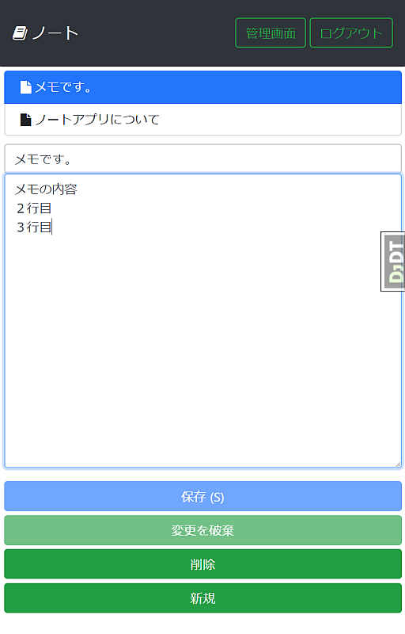

# ノートアプリケーション

[](https://travis-ci.org/tokibito/note-app-django-vuex)



## これは何ですか?

テキストを編集、保存できるシンプルなウェブアプリケーションです。

バックエンドとなるAPIサーバーにはDjangoフレームワーク(Python)、フロントエンドにはVue.js(JavaScript)を使っています。

DjangoフレームワークとJavaScriptでアプリケーションを作るサンプルコードとして作成しました。

**[note-app-django-vue-javascript](https://github.com/tokibito/note-app-django-vue-javascript)のVuex対応版になります。**

以下の要素を含んでいます:

* バックエンド
   * Python3
   * venv
      * プロジェクトで使うPython環境を作成します
   * Djangoフレームワーク
      * Django REST Framework
         * REST APIを作るのに便利な機能がたくさん含まれるモジュール
      * django-debug-toolbar
         * 各種デバッグ情報をサイドバーで表示します
* フロントエンド
   * Babel
      * 最新の言語仕様の構文で書いたコードは、そのままだと古いブラウザなどで動かないので、Babelを使ってトランスパイルして動かせるようにします
   * webpack
      * JavaScriptコードやCSSなど、アプリケーションを構成するファイル群を配備用にまとめます
      * webpack.config.jsでビルドルールを設定します
         * loaderの仕組みによりいろいろな処理ができます(babelで変換したりとか)
   * Vue.js
      * データバインディングとコンポーネントの仕組みを提供するJavaScriptフレームワークです
   * Vuex
      * Vue.jsアプリケーションの状態管理の仕組みを提供するライブラリ(実質フレームワーク)です
   * Bootstrap
      * HTMLのUI部品(ナビゲーションやボタンなどいろいろ)を提供するUIフレームワークです
      * CSSと動きのある部分に必要なJavaScriptコードが提供されます
      * jQuery部分をVue.jsに置き換えたBootstrapVueと組み合わせて使っています
   * Font Awesome
      * Webフォント、CSSが提供されるので、HTMLでクラスを指定すれば使えます
   * axios
      * REST APIクライアントです
   * ユニットテスト
      * mocha
         * ユニットテストのフレームワークです(describe, itで記述)
      * power-assert
         * アサーション関数
      * Sinon.JS
         * モック
      * moxios
         * axiosに対応したモック(スタブ)

## 構成

* `note_server`
   * バックエンド(Pythonで動作するAPIサーバー)
* `note_client`
   * フロントエンド(webpackでビルドし、Djangoフレームワークのstaticfilesモジュールから配信される)
   * CSS(Sass)も含む

## 動かしてみる

1. `note_client` をビルドする
2. `note_server` を起動してブラウザでアクセスする

## 設計について

[note-app-django-vue-javascript](https://github.com/tokibito/note-app-django-vue-javascript)との差分のみ記載します。

アーキテクチャとモジュール構成に関して考えた点など:

* Vuexを使う
   * Vueコンポーネント側の記述を減らせる
   * テストコードは書きやすくなる
      * テストしやすいが、冗長に感じることもある
   * Vuex自体はフレームワークのようなもので、学習コストがかかる点には注意が必要
   * アプリケーションの構造は [Shopping Cart Example](https://github.com/vuejs/vuex/tree/dev/examples/shopping-cart) を参考にしました。
* Vueコンポーネントのテストはがんばらない
   * Vuexを使うことで、VueコンポーネントのUI側のコードを減らせるので、ほとんどやらなくてもよい
   * 変更されやすい部分はがんばらない

## Vagrant

開発にはVagrantを使用しています。VirtualBoxとVagrantをインストールしていれば、同様の環境を用意できます。

```
vagrant up
vagrant ssh
```
